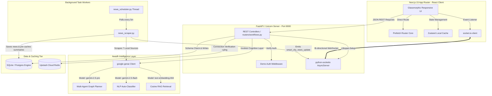
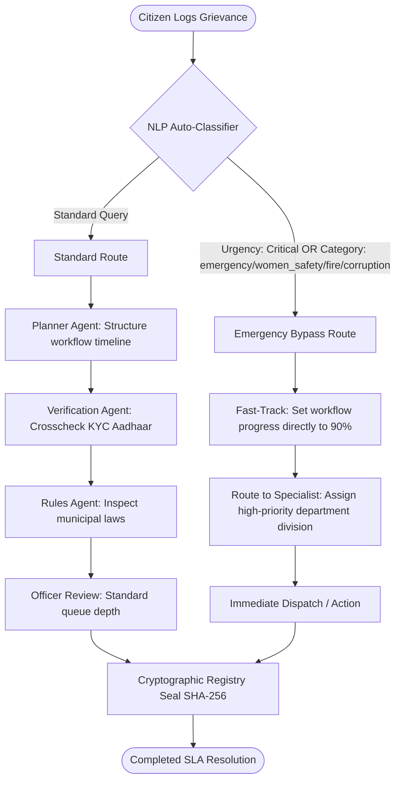
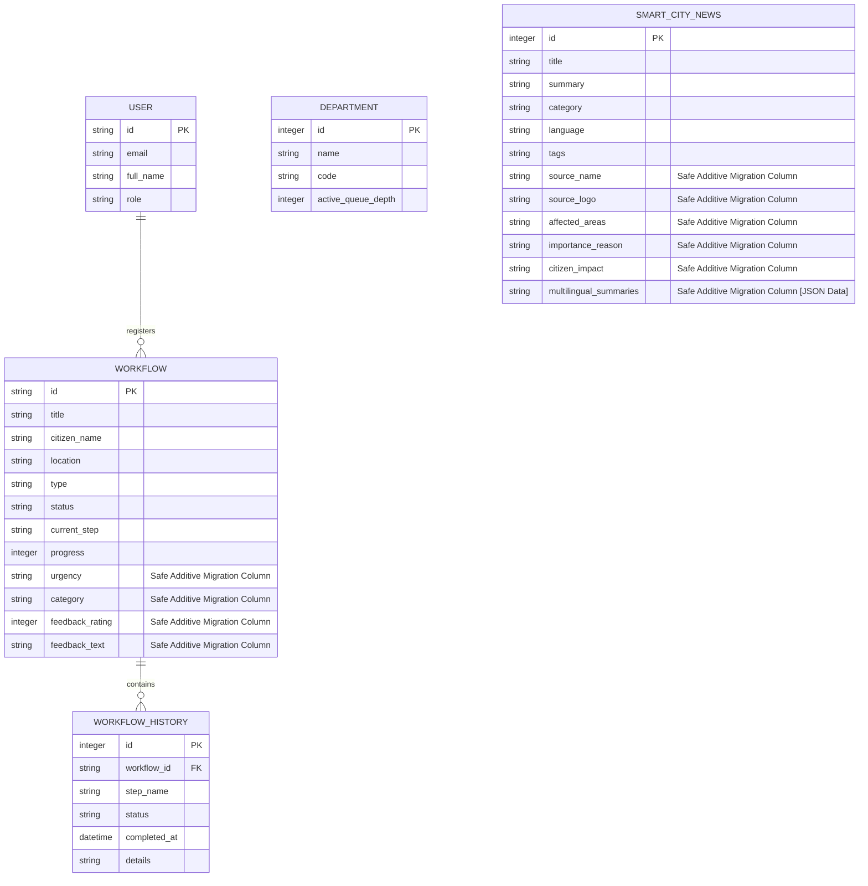

# 🏛️ SarkarAI OS — Master System Architecture Blueprint

This document details the complete, high-fidelity system architecture, agentic orchestration layers, database schemas, and real-time communications flow of **SarkarAI OS**—a futuristic AI-powered sovereign operating system engineered for the **Lucknow Municipal Administration (Lucknow Nagar Nigam)** and the **Lucknow Development Authority (LDA)**.

---

## 🗺️ 1. Multi-Layer System Topology

SarkarAI OS utilizes a decoupled, modern asynchronous architecture optimized for local low-latency responses, resilient API caching, and real-time notifications:



---

## 🧠 2. Cognitive Agentic Orchestration & Emergency Fast-Track

The system features an advanced multi-agent workflow engine. When a citizen files a grievance, it is passed through an intelligent auto-classification pipeline with a critical **Emergency Bypass Bypass** built directly into the graph:



### Cognitive Operations:
1. **Auto-Classification**: Processes natural language descriptors, extracts categories (e.g. `water_leakage`, `women_safety`), and scores priority levels (`low`, `medium`, `critical`).
2. **Specialist Department Assignment**: Matches issues dynamically with correct municipal divisions (*Jal Sansthan*, *UP Land Registry*, *Lucknow CMO*, or specialized *Police Commissions*).
3. **Ledger Integrity Seals**: Upon resolution, hashes citizen data via SHA-256 to generate an official cryptographic governance proof certificate.

---

## 🗄️ 3. Database Relational Schemas

SarkarAI OS incorporates a **Safe Additive Auto-Migration System** (`database.py`) that scans the SQL metadata at startup. If columns are missing, they are appended dynamically without locking tables, losing records, or crashing existing structures.



---

## 📡 4. Real-Time Communications & WebSocket CORS Architecture

To ensure immediate visual updates without page refreshes, SarkarAI OS establishes bidirectional WebSockets connected directly to the user dashboard.

### CORS Conflict Resolution
* **The Problem**: Duplicate CORS headers occurred because both FastAPI’s `CORSMiddleware` and Socket.IO’s `AsyncServer` independently appended `Access-Control-Allow-Origin` headers.
* **The Architecture**:
  1. CORS checking is completely disabled inside python-socketio by configuring `cors_allowed_origins=[]` inside the constructor.
  2. All CORS validation is unified under FastAPI's `CORSMiddleware` configuration block in `main.py`.
  3. This delegative structure routes handshakes cleanly, resolving CORS handshaking locks:

```text
[Browser Client] <== /socket.io Connection ==> [FastAPI CORSMiddleware] (Unified Header Injection)
                                                          ||
                                              [socketio.AsyncServer] (Header Checks Bypassed)
```

---

## 🗃️ 5. Upstash Cloud Redis Integration

SarkarAI OS utilizes secure Upstash Cloud Redis to back cache parameters, maintain quick API rate limits, and provide robust, low-latency key-value cache indexes:
* **Connection Layer**: Swaps local broker threads with secure `rediss://` TLS-wrapped protocols.
* **Resilience Framework**: Validates the cloud socket status upon lifespan boot. If the cloud database fails, it triggers a graceful local thread fallback so dashboard telemetry remains fully active.

```text
[FastAPI lifespans] ──> check settings.REDIS_URL ──> r.ping() 
                                                          │
                                         ┌────────────────┴────────────────┐
                                         ▼                                 ▼
                                  [Ping Success: True]           [Graceful Fallback]
                            Cloud Cache & Queues Active     Local memory simulation activated
```

---

## 📁 6. Technical Stack Reference

| Layer | Technology | Purpose |
| :--- | :--- | :--- |
| **Frontend Core** | Next.js 15, React 19, TypeScript | Core application logic, layout components, and static rendering |
| **Styling & UI** | Tailwind CSS | Sleek glassmorphism overlay grids, neon glows, and dark typography |
| **Fonts & Typography**| Google Fonts (Roboto) | High-fidelity readable administrative and citizen layouts |
| **Backend Framework** | FastAPI (ASGI), Uvicorn | High-performance, asynchronous REST API and WebSocket host |
| **AI Models & SDK** | google-genai, Gemini 2.5 Pro & Flash | Multi-class classifications, dialect summarizations, and agent graphs |
| **Real-time Pipeline**| python-socketio, socket.io-client | Live timeline logging, breaking news marquee ticks, and chat rooms |
| **Database ORM** | SQLAlchemy, SQLite (fallback), Postgres | Relational data management and dynamic runtime auto-migrations |
| **Caching Broker** | Upstash Cloud Redis, redis-py | Global cache pool, state sync registers, and rate limeters |
