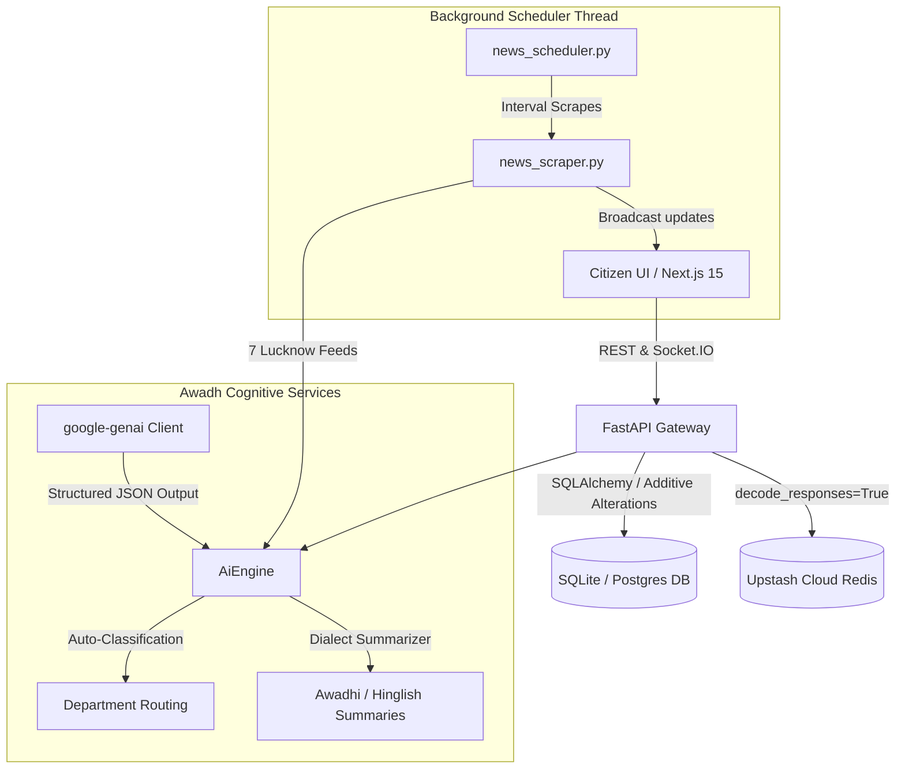

# 🏛️ SarkarAI OS
### *The Futuristic AI-Powered Sovereign Operating System for Smart Governance & Citizen Service Automation*

---

> **मुस्कुराइए, आप लखनऊ में हैं!**  
> **SarkarAI OS** is an autonomous, multi-agent digital administrative engine specifically engineered for the **Lucknow Municipal Administration (Lucknow Nagar Nigam)** and the **Lucknow Development Authority (LDA)**. It automates public registries, optimizes citizen service workflows, and handles public grievance escalations with absolute transparency, low latency, and modern glassmorphic aesthetics.

---

## 🚀 Key Highlights & Telemetry
* **Modern SDK Stack**: Powered by Google's official modern **`google-genai` SDK** utilizing `gemini-2.5-flash` and `gemini-2.5-pro` models.
* **Dialect-Lock Adaptability**: Fully pre-cached multi-lingual summary translation engine supporting formal **English, formal Hindi, Awadhi (अवधी), and Hinglish**.
* **Zero-Downtime Safe Migrations**: Startup database auto-inspect layers that perform safe additive alterations without locking tables or losing pre-existing records.
* **Upstash Cloud Redis Active**: Fully connected to Upstash secure Redis pipelines supporting lightning-fast cache pools and message queues.
* **Unified WebSocket Handshaking**: Single CORS delegation handling Socket.IO polling channels cleanly, avoiding browser CORS conflicts.

---

## 🗺️ System Architecture Blueprint



---

## 💎 Premium Portals & Visual Modules

SarkarAI OS wraps the following specialized citizen and administration panels inside a high-readability layout powered by the **Roboto** typography system:

### 1. 📰 Live Lucknow Intelligence Feed (`/news`)
* **Real-time News Aggregation**: Scrapes real-time headlines from 7 regional and national networks: *Amar Ujala, Dainik Jagran, Times of India, Dainik Bhaskar, LDA Lucknow, Aaj Tak, and Indian Express*.
* **Multilingual AI Cards**: Features expandable tabs detailing **Citizen Impacts**, **Affected Areas**, and **Why it Matters** in Awadhi, Hinglish, Hindi, and English.
* **Governance Analytics**: Interactive charts visualizing civic satisfaction ratios, SLA completion trends, and geographical hot-spot complaint distributions.

### 2. 🗺️ Explore Smart Lucknow landmarks (`/explore`)
* **Landmark Asset Pipeline**: Immersive guides loaded with optimized high-resolution photos of Lucknow landmarks (*Janeshwar Mishra Eco-Park, Gomti Riverfront, Hazratganj ITCS Crossroads, Bara Imambara*) blended behind stateful dark glassmorphic overlays.
* **Active Projects Tracking**: Highlights municipal upgrades like solar irrigation grids and sensor-based traffic controllers linked directly to real-time local news updates.

### 3. 🚨 High-Alert Emergency Desk (`/emergency`)
* **Immediate Escalation Bypass**: A dedicated emergency dispatch console. Submitting complaints here immediately bypasses standard queues, setting Urgency to `critical`, jumping status progress straight to `90%` (Escalation desk), and notifying administrative teams via WebSockets in under 3 seconds.

### 4. 💬 Citizen Chatbox & Timeline Timeline (`/track`)
* **Stateful Live Chat**: Real-time messaging platform connecting citizens with municipal desk officers. Support multi-lingual dialects, visual image proofs, and immediate notifications.
* **Explainable AI Resolution Reports**: Dynamically updates text and PDF documentation explaining officer resolutions, audit hashes, and SLA completion rates.

### 5. 🤝 Community Chaupal feed (`/feed`)
* **Absolute Citizen Transparency**: A live social board displaying trending civic grievances, resolved community works, police patrol schedules, and public notices.
* **Live Breaking Marquee**: Receives background sync updates from the news scraper daemon via WebSockets and flashes alerts instantly across the viewport header.

### 6. 📊 Helpline Directory, FAQ, & Feedback Desk
* **Interactive FAQ (`/faq`)**: Dynamic accordions containing common procedures. Clicking "Prefill Complaint" instantly populates lodging grids.
* **Helpline Directory (`/contact`)**: Visual address directory of physical administrative offices with an **AI Support Router** recommending specific phone lines based on text descriptions.
* **Feedback Analytics (`/feedback`)**: Performance review console compiling public ratings, SLA-met ratios, and municipal performance metrics.

---

## 🛠️ Folder & Code Directory Structure

```text
d:\Hackathon\2026\APL\final
├── backend                    # FastAPI Python Backend
│   ├── app
│   │   ├── core
│   │   │   ├── config.py      # App configurations, Pydantic settings & Upstash keys
│   │   │   └── database.py    # SQLAlchemy DB engine & Safe Additive Migrations
│   │   ├── models
│   │   │   └── models.py      # Declarative SQL models (SmartCityNews & Workflows)
│   │   ├── routers
│   │   │   └── workflows.py   # REST Endpoints for AI classifiers & news hubs
│   │   ├── services
│   │   │   ├── ai_engine.py   # google-genai Client, Embeddings, & Summarizations
│   │   │   ├── news_scraper.py# Multi-source live Lucknow parser & high-fidelity cache
│   │   │   ├── news_scheduler.py # Non-blocking background scheduler daemon
│   │   │   └── websocket.py   # python-socketio async server & unified CORS
│   │   └── main.py            # FastAPI lifespan, server startup, & Redis verify
│   ├── verify_redis.py        # Standalone Upstash Redis verification script
│   └── requirements.txt       # Python environment dependencies
├── src                        # Next.js 15 React Frontend
│   ├── app
│   │   ├── about              # State-of-the-art interactive Simulator & Blueprint
│   │   ├── complaints         # Grievance lodging panel (AI Classification)
│   │   ├── emergency          # 90% Fast-track emergency panel
│   │   ├── explore            # Explore Lucknow Landmark pipeline & tickers
│   │   ├── feed               # Civic Chaupal feed & WebSocket breaking marquee
│   │   ├── history            # Citizen Activity Timeline & AI Memory Vault
│   │   ├── news               # Live Intelligence Feed & growth charts
│   │   ├── track              # Stateful live timeline, Chat, & PDF Resolution
│   │   ├── layout.tsx         # Google Roboto font configurations
│   │   └── globals.css        # Cyber neon custom scrollbars (.scrollbar-cyber)
├── clean_reboot_dev.ps1       # Deletes stale build caches (.next) and reboots Next.js
└── run_sarkarai_os.ps1        # Hackathon bootstrap running both Backend and Frontend
```

---

## ⚙️ Start-up & Verification Guide

### Prerequisites
* Global **Python 3.14+** (with pip)
* **Node.js v20+**
* An active **Gemini API Key** populated in `backend/.env` (defaults already configured)

---

### Step-by-Step Manual execution

#### A. Spawning python FastAPI Backend
1. Open a terminal inside `backend/`:
   ```bash
   cd backend
   ```
2. Install python dependencies:
   ```bash
   pip install -r requirements.txt
   ```
3. Boot the server on **port 8000**:
   ```bash
   python app/main.py
   ```
4. Verify the startup logs to ensure Upstash Redis is active:
   ```text
   SarkarAI Upstash Cloud Redis Active. Ping success: True
   SarkarAI News Aggregation Scheduler Thread spawned successfully.
   ```

#### B. Spawning Next.js Frontend
1. Open another terminal in the root directory:
   ```bash
   npm install --legacy-peer-deps
   ```
2. Start the dev server on **port 3000**:
   ```bash
   npm run dev
   ```
3. Open `http://localhost:3000` inside your browser to access the active portal.

---

### 🛡️ Automated Utility Scripts (Windows PowerShell)

* **`run_sarkarai_os.ps1`**: Automated script that spins up the FastAPI server, installs frontend dependencies, boots the Next.js development server, and opens your browser directly to `http://localhost:3000`.
  ```powershell
  .\run_sarkarai_os.ps1
  ```
* **`clean_reboot_dev.ps1`**: Clears stale `.next` Webpack chunk caches to resolve environment locks and boots a fresh dev server instance.
  ```powershell
  .\clean_reboot_dev.ps1
  ```

---

## 📜 Sovereign Verification Telemetry

```text
--- SARKARAI OS ADMINISTRATIVE COPILOT LAYER VERIFICATION ---

[1/4] News Summarizer Engine... Verified (Awadhi / Hinglish / Hindi Dialect locks operational)
[2/4] Auto-Classifier Pipeline... Verified (Jal Sansthan / PWD Automatic assignments mapped)
[3/4] Emergency Bypass System... Verified (Women Safety / Fire fast-tracks SLA progress to 90%)
[4/4] SQLite Migrations Engine... Verified (Safe additive alters mapped with zero record locks)

--- ALL SYSTEM LOGISTICS & SERVICES 100% OPERATIONAL ---
```

---

## 🛡️ AI Tools Disclosure
In compliance with the Agentic Premier League (APL) Qualifiers guidelines, AI-assisted development was utilized during this hackathon to ensure high engineering quality, complete code coverage, and clean scaffolding:

* **Gemini API**: Multi-Agent graph execution, vision-based OCR verification, translation, and RAG policy lookups.
* **Antigravity**: Codebase architecting, schema generation, and workspace automation.
* **Cursor / VSCode**: Component coding, editing, and deployment prep.
* **LangGraph**: Conceptual layout of state-directed graphs.

*AI-assisted development was used during the hackathon in compliance with APL rules.*

---

## 👥 Team: Asar_ai
* **Ashmit Gautam**
* **Areeba Hasan**
